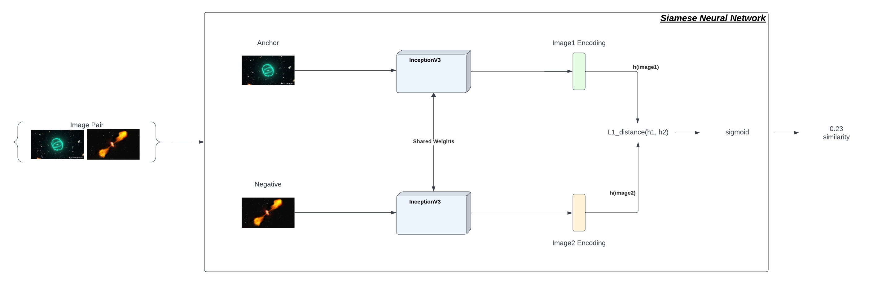

# Detecting Odd Radio Circles with Siamese Convolutional Neural Networks

## 📄 Full Paper

Read the full research report here:  
[Detecting Odd Radio Circles with Siamese CNNs (PDF)](docs/Detecting_odd_radio_circles_with_Siamese_Convolutional_Neural_Networks.pdf)

## Overview

This project investigates the use of **Siamese Convolutional Neural Networks (SNNs)** to identify and classify **Odd Radio Circles (ORCs)** — a newly discovered class of celestial radio objects. Given their rarity and morphological similarity to other radio sources like FRII galaxies, the study employs **few-shot learning** techniques to overcome data scarcity. The best results were achieved using a VGG-16 based SNN architecture, with promising classification accuracy even in low-data regimes.

## Problem Statement

ORCs are mysterious, circular-shaped radio sources discovered in 2019. Their origin and nature remain unclear, and due to their limited number, traditional deep learning methods fall short in identifying them. This project aims to:
- Distinguish ORCs from similar radio galaxies (e.g., FRII, Bent Tail).
- Leverage few-shot learning and data augmentation to classify ORCs.
- Evaluate the performance of various internal CNN backbones (AlexNet, VGG-16, InceptionV3) within the SNN architecture.

## Methodology

The study is structured around **four main experiments** using two types of datasets (radio galaxies and ORCs), both augmented and non-augmented:

| Experiment | Dataset Size | Purpose |
|-----------|---------------|---------|
| RG_NA     | 150           | Radio Galaxy (Non-Augmented) |
| RG_AG     | 3150          | Radio Galaxy (Augmented) |
| ORC_NA    | 12            | ORC (Non-Augmented) |
| ORC_AG    | 252           | ORC (Augmented) |

Each dataset was preprocessed from FITS to JPG, with sigma-clipping applied to suppress noise. Data augmentation techniques included flipping, rotation, and cropping.

### Siamese Network Architecture

The SNN uses twin VGG-16 CNNs with shared weights. Outputs are compared using an **L1 distance layer**, determining similarity between image pairs. The objective is to maximize distances between dissimilar objects (e.g., ORC vs FRII) and minimize distances for similar ones.

## Results

| Model      | Experiment | Accuracy | Precision | Recall | ROC-AUC |
|------------|------------|----------|-----------|--------|---------|
| VGG-16     | ORC_NA     | 100%     | 100%      | 1.00   | 1.00    |
| VGG-16     | ORC_AG     | **91.63%** | **90.36%**  | 1.00   | **0.9755** |
| VGG-16     | RG_AG      | 56.53%   | 53.98%    | 0.98   | 0.7235  |
| AlexNet    | RG_AG      | 59.42%   | 62.16%    | 0.61   | 0.6652  |
| InceptionV3| RG_AG      | 60.19%   | 56.4%     | 0.94   | 0.6958  |

The **VGG-16 SNN architecture** consistently outperformed others, especially in ORC classification.

## Technologies Used

- Python
- TensorFlow / Keras
- NumPy, SciPy, Matplotlib
- FITS Image Handling (`astropy`)
- PCA for data visualization
- Jupyter Notebooks (for experimentation)

## Key Findings

- **Few-shot learning** using Siamese Neural Networks is effective for ORC identification, even with extremely limited data.
- **Data augmentation** significantly enhances model generalization, especially for scarce astronomical datasets.
- The combination of **VGG-16** as the base CNN and the **RMSProp optimizer** with a **learning rate of 1e-5** provided the most stable and highest-performing results.

## Future Work

- Expand the current approach to include **one-shot learning** techniques for even more extreme data-scarce scenarios.
- Integrate **transfer learning** to generalize the SNN model to classify other types of celestial radio sources.
- Investigate **cross-wavelength data fusion** by combining radio, optical, and infrared imagery for richer and more comprehensive classification tasks.
